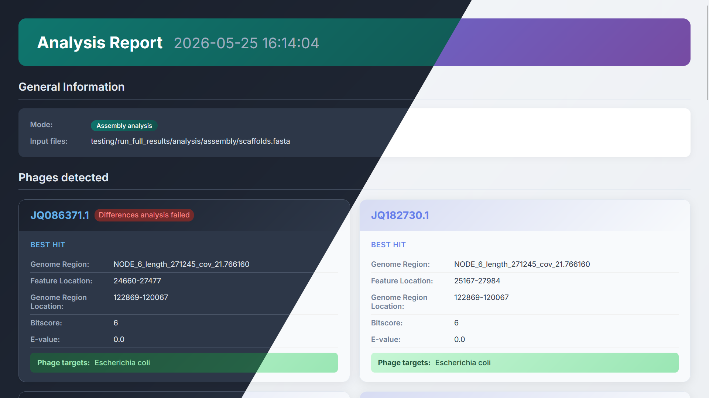
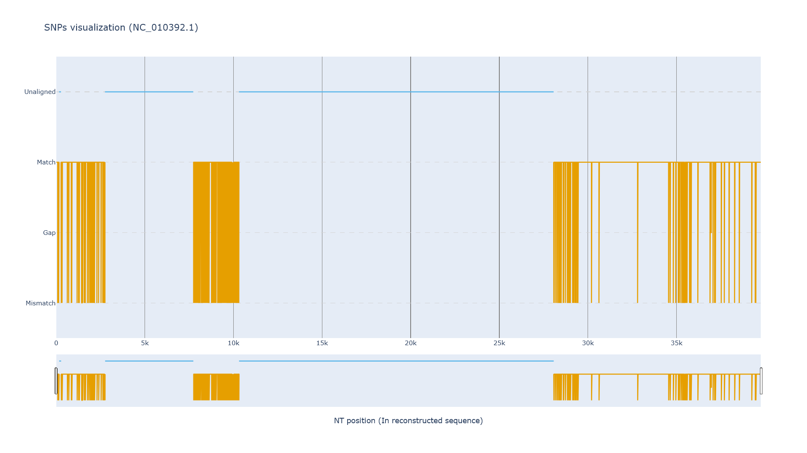
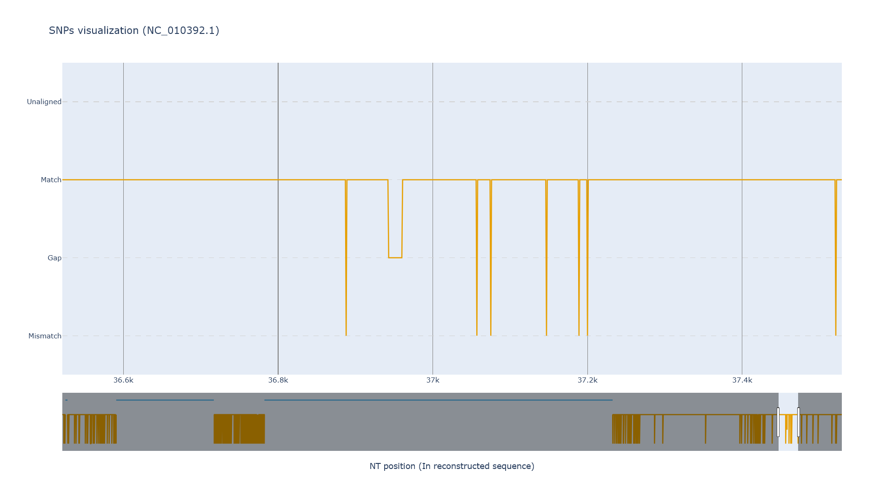

# PhageFind
### English
PhageFind is a bioinformatics tool designed to identify specific bacteriophages in bacterial genomes. The program comprises three main modules accessible via a command-line interface. The first one allows the download of bacteriophage reference sequences from the PhageScope online database. The second implements an automated pipeline that includes the pre-processing of bacterial sequencing data, de novo genome assembly, identification of potential bacteriophages present in the genome, comparative analysis between the detected bacteriophages and the references used, as well as the generation of graphs for visualising results. Furthermore, the tool produces a report in HTML format that summarises the most relevant information from the analysis. The third module facilitates the automated installation of the dependencies required to run the program. PhageFind can be configured via a TOML file, and provides documentation on its use accessible directly from the terminal.

### Español
PhageFind es una herramienta bioinformática orientada a la identificación de bacteriófagos específicos en genomas bacterianos. El programa integra tres módulos principales accesibles mediante una interfaz de línea de comandos. El primero permite la descarga de secuencias de referencia de bacteriófagos desde la base de datos online PhageScope. El segundo implementa una pipeline automatizada que incluye el preprocesamiento de datos de secuenciación bacteriana, el ensamblaje de novo de genomas, la identificación de posibles bacteriófagos presentes en el genoma, el análisis comparativo entre los bacteriófagos detectados y las referencias utilizadas, así como la generación de gráficos para la visualización de resultados. Además, la herramienta produce un reporte en formato HTML que resume la información más relevante del análisis. El tercer módulo facilita la instalación automatizada de las dependencias necesarias para la ejecución del programa. PhageFind puede configurarse mediante un archivo en formato TOML y ofrece documentación sobre su uso accesible directamente desde la terminal.

## Installation and usage
### 1. Download the latest release for your OS
Download the latest release for your OS in the [releases page](https://github.com/DarthPapalo/phagefind/releases).
> [!NOTE]
> They already include the micromamba binaries to make installing dependencies easier.

### 2. Install dependencies
Make sure you have the python version specified in the `.python-version` file installed.
The python program also relies on the following dependencies defined in the `pyproject.toml` file:
```toml
dependencies = [
    "rich>=14.3.3",
    "dacite>=1.9.2",
    "pandas>=3.0.0",
    "plotly>=6.5.2",
    "jinja2>=3.1.6",
    "requests>=2.33.1",
    "clapy",
]
```

*Clapy* is a python CLI argument parsing library developed by Pablo Vidal with this project in mind, it can be found in [GitHub](https://github.com/DarthPapalo/clapy) and it is specified in the `pyproject.toml` file:
```toml
[tool.uv.sources]
clapy = { git = "https://github.com/DarthPapalo/clapy", rev = "9a03f6b67d54ad07862a3ef3b969adcb08dc49b9" }
```

> [!TIP]
> Use [UV](https://docs.astral.sh/uv/) to manage the python dependencies automatically. Read more about it at the end of this section.

To install the rest of the dependencies run:
```
python phagefind.py install-programs --dir <Installation directory> --paths-file <Paths file>
```
Where ***`<Installation directory>`*** is the directory where the required programs will be installed.

Where ***`<Paths file>`*** is the file that where the programs paths will be stored, required later by the analysis pipeline. The **default path** is the same one used by the `analysis` command, leave it empty so you don't have to configure it later.

***Alternatively***, if you already have the necessary programs, you can create your own file with the required programs paths to be used by the pipeline, it should follow this TOML structure (Make sure you use absolute paths):

```toml
samtools = "<samtools path>"

fastp = "<fastp path>"

spades = "<spades.py path>"

[blastplus]
# Programs from the NCBI BLAST+ suite
blastn = "<blastn path>"
makeblastdb = "<makeblastdb path>"

[mummer]
# Programs from the MUMmer package
nucmer = "<nucmer path>"
show_aligns = "<show-aligns path>"
dnadiff = "<dnadiff path>"
```

You will have to specify this file using the `--programs-paths` argument in the other commands, or store it in the programs directory with `programs_paths.toml` as the name.

### 2.1 ***OPTIONAL*** - Download bacteriophage data from the PhageScope database
The program also has a command to download bacteriophage data from the PhageScope database, simply run:
```
python phagefind.py download-data --sources <DB names> --data-types <Data types> --output <Output directory>
```

Where ***`<DB names>`*** is a space-separated list of databases from the available ones (*Case sensitive*): `RefSeq, Genbank, DDBJ, EMBL, PhagesDB, GPD, GVD, MGV, TemPhD, CHVD, IGVD, IMG_VR, GOV2, STV`

Where ***`<Data types>`*** is a space-separated list of the desired types of data to download from the available ones: `Genome, Gene, Metadata` (Gene requires Genome)

***Optionally*** use `--keep-individual` to keep the individual files from each source (merged and deleted afterwards by default), or `--no-verify` to disable SSL certificate verification before downloading.

### 3. Run the pipeline
To run the pipeline with your bacteria reads/assembly simply execute:

***For reads analysis:***
```
python phagefind.py analyze reads <Reads file ...> --query <Multi-FASTA bacteriophage sequences file>
```
And optionally use:
  - `--preprocessing` to enable reads preprocessing (Only available for FASTQ format reads)
  - `--paired-ends` to enable paired ends assembly (Make sure you submit each pair of reads in order, e.g. read_1_1 read_1_2 read_2_1 read_2_2 ...)
  - `--metadata <Metadata file ...>` to enable the identification of extra bacteria targets for each identified bacteriophage in the analysis report.

***For assembly analysis:***
```
python phagefind.py analyze assembly <Assembly path> --query <your Multi-FASTA bacteriophage sequences file>
```
And optionally use:
  - `--metadata <Metadata file ...>` to enable the identification of extra bacteria targets for each identified bacteriophage in the analysis report.

> [!NOTE]
> You can also use the `--help` or `-h` arguments to display the help for any command directly in the CLI

### 4. Generate visualizations
The program can also generate graphs to visualize the SNPs between the found bacteriophage sequences in the bacteria genome and their references.

To generate graphs for a set of feature IDs run:
```
python phagefind.py visualization <Feature IDs> --features-dir <Features dir> --output <Output directory>
```

Where ***`<Feature IDs>`*** is a space-separated list of the different detected bacteriophages IDs/ACCs (e.g. JQ182730.1). You can also use **"ALL"** to generate visualizations for all the features present in the specified directory.

Where ***`<Features dir>`*** is the **differences** directory created during the analysis pipeline

### ***OPTIONAL*** - Using a custom configuration
By default, the program looks for a `config.toml` file in the same directory as the `phagefind.py` file to load it instead of the default one. You can specify a custom configuration file using the `--config` argument.

See the default configuration in the `default_config.toml` file, it also contains comments explaining each parameter.

### ***OPTIONAL*** - Executing using [UV](https://docs.astral.sh/uv/) and shebang
UV is an extremely fast Python package and project manager, written in Rust. It installs and manages Python versions while providing comprehensive project management, with a universal lockfile.

To execute the program with UV simply execute:
```
uv run phagefind.py <Additional arguments, ...>
```
No need to manage any python dependencies, UV does this for you.

You can also execute `phagefind.py` by simply invoking the file like `./phagefind.py`. It will look for the defined python3 executable in your current enviroment using the provided shebang `#!/usr/bin/env python3` (Make sure it has execution permissions - `chmod +x`).

## Examples
### Analysis report


### SNPs graph
#### No zoom


#### Zoomed view


## License
PhageFind is licensed under the GNU General Public License v3.0<br>
See file [LICENSE](LICENSE) for more details.

## Credits
### PhageScope
Ruo Han Wang, Shuo Yang, Zhixuan Liu, Yuanzheng Zhang, Xueying Wang, Zixin Xu, Jianping Wang, Shuai Cheng Li, PhageScope: a well-annotated bacteriophage database with automatic analyses and visualizations, Nucleic Acids Research, 2023;, gkad979, https://doi.org/10.1093/nar/gkad979

### Micromamba
[micromamba](https://github.com/mamba-org/micromamba-releases) is the statically linked version of [mamba](https://github.com/mamba-org/mamba), a reimplementation of the conda package manager in C++.

### fastp
Shifu Chen. fastp 1.0: An ultra-fast all-round tool for FASTQ data quality control and preprocessing. iMeta 4.5 (2025): e70078 https://doi.org/10.1002/imt2.70078

### SPAdes
Prjibelski, A., Antipov, D., Meleshko, D., Lapidus, A., & Korobeynikov, A. (2020). Using SPAdes de novo assembler. Current Protocols in Bioinformatics, 70, e102. doi: 10.1002/cpbi.102

### NCBI BLAST+
Altschul SF, Gish W, Miller W, Myers EW, Lipman DJ. Basic local alignment search tool. J Mol Biol. 1990 Oct 5;215(3):403-10. doi: 10.1016/S0022-2836(05)80360-2. PMID: 2231712.

### MUMmer
MUMmer4 and nucmer4 are described in "MUMmer4: A fast and versatile genome alignment system" G. Marçais , A.L. Delcher, A.M. Phillippy, R. Coston, S.L. Salzberg, A. Zimin, PLoS computational biology (2018), 14(1): e1005944.

### plotly.py
[plotly.py](https://github.com/plotly/plotly.py) is an interactive, open-source, and browser-based graphing library for Python.